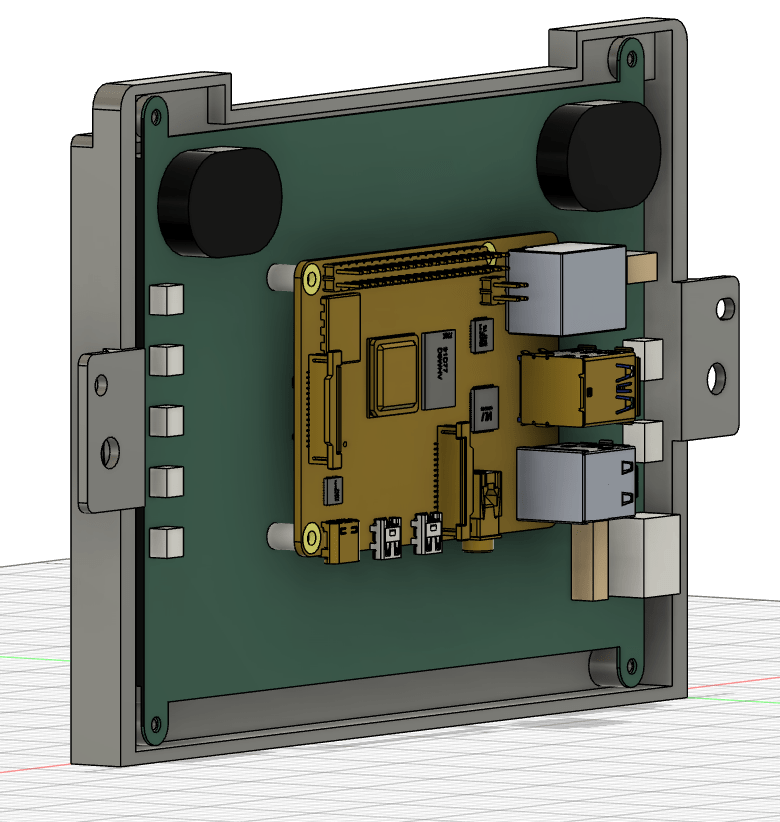

# MiataDash

## Description
This is a project I worked on in 2021 that I've always wanted to release but was too lazy to.

This kind of bracket (`headunit.step`) is meant to be used on any Mazda MX5/Miata NB 1998-2005 (I'm not sure if it might be compatible with other models).

It was designed to fit [this](https://amazon.it/dp/B07L6WT77H) specific display/touchscreen, since we can mount a Raspberry Pi on its back.

I hope that it will be useful to someone.

## 3D Model

## The result

